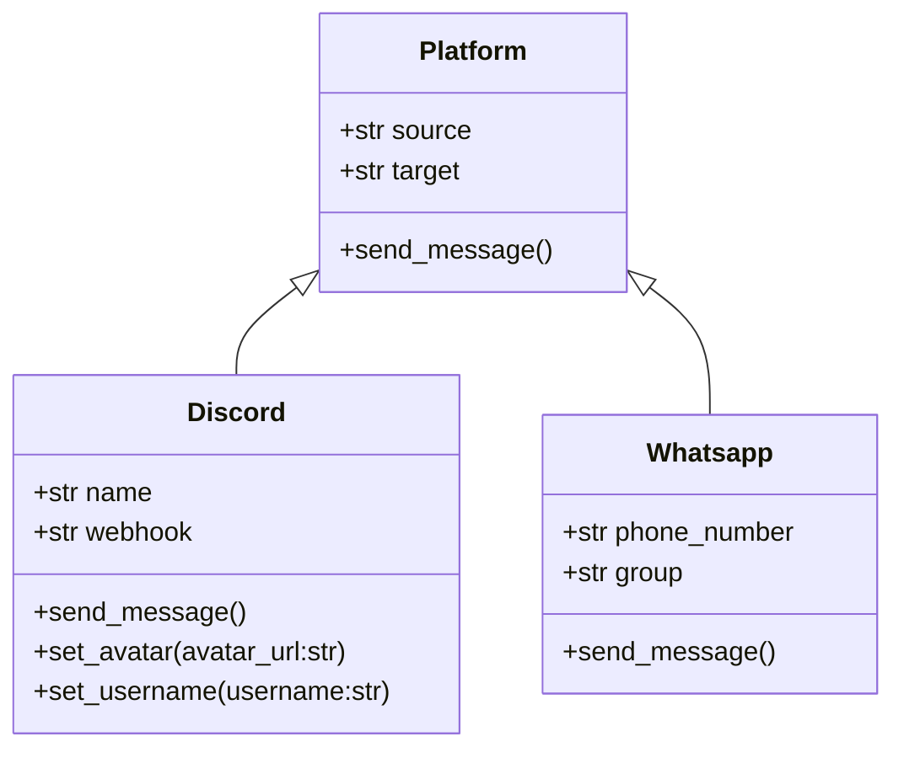

Cover bot go brr.

- [Intro](#intro)
- [Usage](#usage)
  - [Creating an event](#creating-an-event)
  - [Main loop](#main-loop)
- [Design](#design)
  - [Platforms](#platforms)
  - [Message](#message)


## Intro
This bot is designed to be a simple way to get notifications whenever a user signs up for your Cover form. All you need to do to get the full functionality is to make sure you have access to the form on the Cover website and log in to your account (by passing credentials to the bot).

From there, you can decide whether to post notifications on Discord or on Whatsapp. The bot will automatically check for new signups every 5 minutes and send a message to the specified channel if there are any new signups. You can also specify a custom message to be sent along with the notification.

> [!Important]
> In order to not get banned on Whatsapp, a random quote will be sent every time the bot sends a message. I advise you not to change this behaviour.


## Usage

### Creating an event
You need to initialize a `Form` object:

```python
from .cover.cover import Cover
from .cover.form import Form

cover = Cover(email="email", password="password")
form = form(
    name="Event 1",
    url="https://svcover.nl/sign_up/123465/entries",
    cover=cover, # Pass the Cover object here
    platforms=[
        {
            "source": "discord",
            "target": "webhook",
            "name": "Guild 1",
            "webhook": "https://discord.com/api/webhooks/1234567890/abcdefghijklmnopqrstuvwxyz",
        },
        {
            "source": "whatsapp",
            "target": "group",
            "phone_number": "+1234567890",
            "groups": [
                {
                    "name": "Group 1",
                }
            ]
        }
    ]
)
```
If you want to save the event to a json file, you can do so by calling the `save` method:

```python
form.save()
```

Where a json file (`forms.json`) is created/updated of the form:

```json
{
  "forms": [
    {
      "name": "Event 1",
      "url": "https://svcover.nl/sign_up/123465/entries",
      "discord": {
        "guilds": [
          {
            "name": "Guild 1",
            "webhook": "https://discord.com/api/webhooks/1234567890/abcdefghijklmnopqrstuvwxyz",
          }
        ]
      },
      "whatsapp": {
        "phone_number": "+1234567890",
        "groups": [
          {
            "name": "Group 1",
          }
        ]
      }
    }
  ]
}
```

### Main loop
The main loop of the bot is designed to run indefinitely and check for new signups every 5 minutes. And execute the forms in the list. You can either pass list of `Form` objects or load from a json to execute `run` method:

```python 
from .cover.cover import Cover
from .cover.form import Form
import time

cover = Cover(email="email", password="password")
# events = [Form(), Form(), Form()] <- List of form objects
events = Cover.load_events() # Load events from json file (default: forms.json)
while True:
  try:
    for event in events:
        event.run()
    time.sleep(300)
  except KeyboardInterrupt:
    print("Exiting...")
    break
```

## Design

### Platforms
We use inheritance to describe the platforms:


### Message
To achieve uniformity, we generate an image comprised of:
- The banner of the form
- Date of new signup
- Total number of signups

With the addition of a random quote sent on whatsapp.

The image generation is handled by the `img` module.